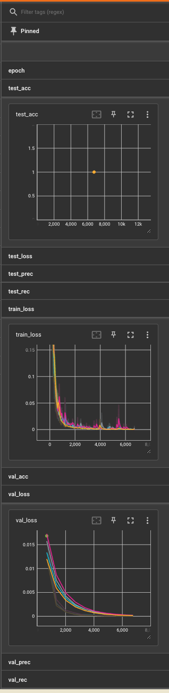

# Pytorch Lightning Churn Predictor Model

This Churn Predictor is a deep learning model built using PyTorch and PyTorch Lightning. The model is a type of feed-forward neural network with three layers, batch normalization, and dropout for regularization.

### Model Architecture

The model consists of three linear layers (nn.Linear), each followed by a batch normalization layer (nn.BatchNorm1d) and a dropout layer (nn.Dropout). The activation function used is the Leaky ReLU function (F.leaky_relu), and the final output is passed through a sigmoid function (torch.sigmoid) to ensure the output is between 0 and 1, suitable for binary classification.

- The first layer (self.layer1) takes the input data and transforms it into a hidden representation of size hidden_size.
- The second layer (self.layer2) takes the output of the first layer and transforms it into another hidden representation, also of size hidden_size.
- The third layer (self.layer3) takes the output of the second layer and transforms it into the final output of size output_size.

Batch normalization is used after the first and second layers to normalize the inputs to each layer for each mini-batch. This has the effect of stabilizing the learning process and dramatically reducing the number of training epochs required to train deep networks.

Dropout is also used after the first and second layers as a regularization technique, where during training, random subsets of the neurons are "dropped out", or temporarily removed from the network. This prevents overfitting by ensuring that the model does not rely too heavily on any single neuron.

### Parameter Choices

The parameters for the model are chosen based on the problem requirements and the nature of the input data:

- `input_size`: This is set to 14, which corresponds to the number of features in the input data.
- `hidden_size`: This is set to 20, which is a hyperparameter that determines the size of the hidden layers in the network. The optimal value for this parameter would typically be determined through experimentation, which we do in the enhanced version of this model.
- `output_size`: This is set to 1, which is appropriate for a binary classification problem where the model needs to output a single probability.
- `batch_size`: This is set to 64, which is a common choice for the batch size. The batch size is another hyperparameter that can be tuned, and it determines the number of training examples used in one iteration of model training. We tune this parameter in the enhanced version of this model.

The learning rate for the Adam optimizer is set to 1e-3, and the scheduler decreases the learning rate by a factor of 0.9 every epoch. These are common settings that often work well in practice.

### Data Preparation

The model uses a custom data loader to load and preprocess the data. The data is loaded from a CSV file, split into training, validation, and test sets, and standardized using StandardScaler from sklearn.preprocessing. The gender feature is also converted from a string to an integer representation. The data is then converted into PyTorch tensors and loaded into a DataLoader, which allows for efficient loading and batching of the data during training.

### Training and Testing

The model is trained for 10 epochs using `pl.Trainer`. After training, the model is tested on the test data. The training and testing processes both involve computing the binary cross-entropy loss and several metrics, including accuracy, precision, and recall. These metrics are logged for later analysis.

  | Name        | Type        | Params
--------------------------------------------
0 | layer1      | Linear      | 300   
1 | batch_norm1 | BatchNorm1d | 40    
2 | dropout1    | Dropout     | 0     
3 | layer2      | Linear      | 420   
4 | batch_norm2 | BatchNorm1d | 40    
5 | dropout2    | Dropout     | 0     
6 | layer3      | Linear      | 21    
--------------------------------------------

